#  Hey there, I'm **Sayan Sen** 👨‍💻

<div align="center">
  


<br>

[](https://github.com/Sayan0361)
[](https://sayan-sen.vercel.app/)
[](https://codolio.com/profile/Sayan0361)
[](mailto:sayansen0361@gmail.com)

</div>

---

<div align="center">

## 🚀 About Me

</div>


```yaml
Name: Sayan Sen
Role: Backend Developer & Problem Solver
Education: B.Tech in Information Technology
Focus: Building scalable web solutions
Currently: Mastering advanced DSA & MERN stack
Goal: Full-Stack Software Developer
```

**🔭 What I'm up to:**
- 🎯 Diving deep into **Data Structures & Algorithms**
- 🌱 Building robust backends with **Node.js & Express**
- 💡 Creating full-stack applications with **MERN**
- 📚 Continuously learning and growing in tech

---

## 🛠️ **Technology Arsenal**

<div align="center">

### **💻 Programming Languages**
<p>
  
</p>

### **🎨 Frontend Development**
<p>
  
</p>

### **⚙️ Backend & Database**
<p>
  
</p>

### **🔧 Tools & Platforms**
<p>
  
</p>

</div>

---

## 📈 **GitHub Analytics**

<div align="center">
  
<table>
<tr>
<td width="50%">


</td>
<td width="50%">


</td>
</tr>
</table>


</div>

---

## 🏆 **Achievements & Progress**

<div align="center">

### **LeetCode Journey**


### **DSA Mastery**


### **GitHub Trophies**


</div>

---

## 🎯 **Current Focus**

```mermaid
graph TD
    A[🎯 Learning Goals] --> B[Advanced DSA]
    A --> C[MERN Mastery]
    A --> D[System Design]
    B --> E[Problem Solving]
    C --> F[Full-Stack Projects]
    D --> G[Scalable Architecture]
    E --> H[🚀 Software Developer]
    F --> H
    G --> H
```

<div align="center">



</div>

---

## 🔥 **Recent Activity**

<div align="center">

<!--START_SECTION:activity-->
<!--END_SECTION:activity-->


</div>

---

## 🌐 **Let's Connect**

<div align="center">

<table>
<tr>
<td align="center" width="25%">
  <a href="https://www.linkedin.com/in/sayan-sen-38b198255">
    
    <br><strong>LinkedIn</strong>
  </a>
</td>
<td align="center" width="25%">
  <a href="https://www.instagram.com/sayan_sen007/">
    
    <br><strong>Instagram</strong>
  </a>
</td>
<td align="center" width="25%">
  <a href="https://m.facebook.com/profile.php?id=100040647903469">
    
    <br><strong>Facebook</strong>
  </a>
</td>
<td align="center" width="25%">
  <a href="mailto:sayansen0361@gmail.com">
    
    <br><strong>Email</strong>
  </a>
</td>
</tr>
</table>

</div>

---

<div align="center">

### 💭 **Random Dev Quote**


<br>

### 🎵 **Currently Listening To**
[](https://spotify-github-profile.kittinanx.com/api/view?uid=31z5ujzulhf2tnlktal4earnvxlq&redirect=true)

<br>


---


*Thanks for visiting! Feel free to explore my repositories and don't forget to star ⭐ if you find something interesting!*

</div>
